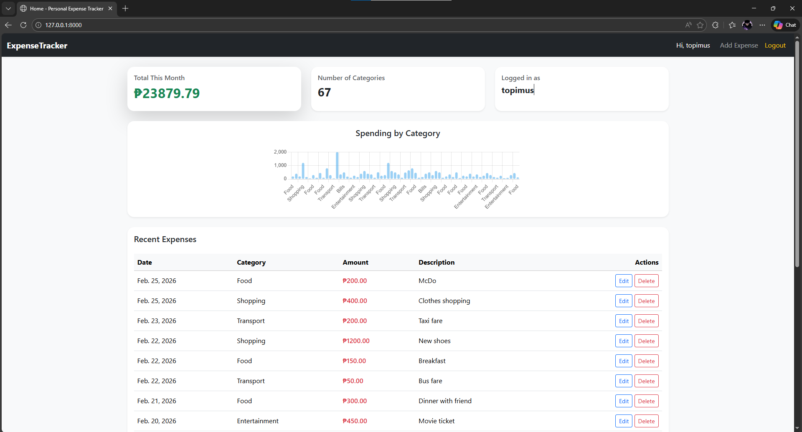

# Personal Expense Tracker

A full-stack Django web application for tracking personal expenses.

## Features
- User authentication (login/register/logout)
- Add, edit, delete, and view expenses
- Dashboard with monthly totals and category-wise spending
- Paginated expense table
- Responsive UI

## Technologies
- Django, MySQL, Bootstrap 5, Chart.js
- Python 3.x

## Installation
1. Clone the repo:

```bash
git clone https://github.com/yourusername/personal-expense-tracker.git
cd personal-expense-tracker
```
2. Create a virtual environment:

```bash
python -m venv venv
source venv/bin/activate  # mac/linux
venv\Scripts\activate     # windows
```

3. Install dependencies:

```bash
pip install -r requirements.txt
```

4. Set up MySQL database and update settings.py accordingly.
5. Run migrations:

```bash
python manage.py migrate
```

6. Run server:

```bash
python manage.py runserver
```

---

## Screenshot

### Dashboard
